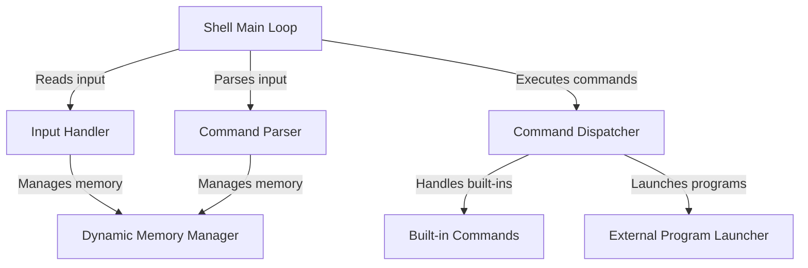

# Dhruva shell

The `dhruva_shell` project is a basic command-line program, acting like a *mini-operating system interface*. It works by continuously *listening* for your commands, *understanding* what you want to do, and then *running* those actions for you. Think of it as a **simple but functional tool** that lets you interact with your computer by typing instructions.

## Visual Overview

## Chapters

1. [Shell Main Loop](docs/Shell_Main_Loop.md)
2. [Input Handler
](docs/Input_Handler_.md)
3. [Command Parser
](docs/Command_Parser_.md)
4. [Command Dispatcher
](docs/Command_Dispatcher_.md)
5. [Built-in Commands
](docs/Built_In_Commands_.md)
6. [External Program Launcher
](docs/External_Program_Launcher_.md)
7. [Dynamic Memory Manager
](docs/Dynamic_Memory_Manager_.md)

---
