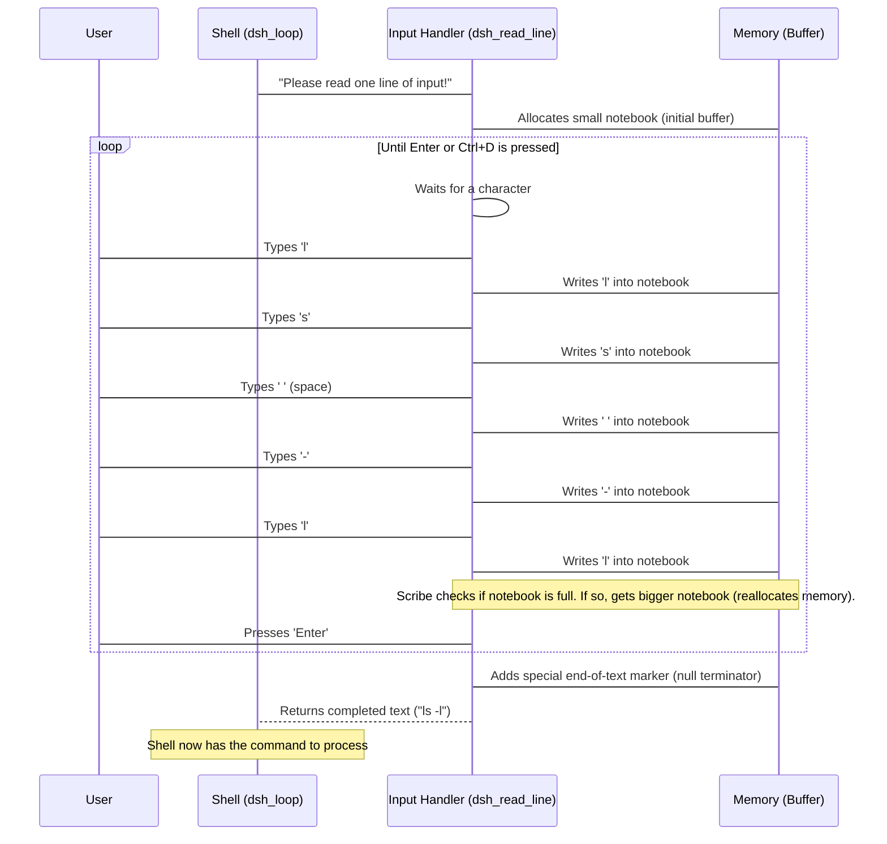

# Chapter 2: Input Handler

In [Chapter 1: Shell Main Loop](Main_Shell_Loop.md), we learned that the `dhruva_shell` constantly runs in a `dsh_loop` that cycles through several steps: prompt, read, parse, execute, and repeat. The very first step after showing the prompt is **reading** your input. But how does a computer program actually "hear" what you type on the keyboard? That's where the **Input Handler** comes in!

## Listening to Your Commands

Imagine `dhruva_shell` as a very patient scribe. When you see the `dhruva >` prompt, it's like the scribe saying, "I'm ready to take notes!" The scribe then waits, pen poised, for you to start speaking (typing).

**The problem it solves:** How does `dhruva_shell` capture everything you type, character by character, until you press the 'Enter' key? And what if you type a very long command? How does it make sure it has enough "paper" (memory) to write it all down?

**The solution:** The Input Handler is a dedicated part of `dhruva_shell` that focuses solely on this task. It's designed to:
1.  Listen for every key press.
2.  Collect these characters in order.
3.  Know when you're finished typing (when you press Enter or signal the end of input).
4.  Be smart enough to get more "paper" if your command is longer than expected.

In `dhruva_shell`, the `dsh_read_line()` function is our Input Handler.

## How to Use the Input Handler

From our `dsh_loop` in [Chapter 1](01_shell_main_loop_.md), you might remember this line:

```c
// File: src/main.c

void dsh_loop(void) {
    char *line;   // Will store the line of text you type
    // ...
    printf("dhruva > ");            // 1. Show the prompt
    line = dsh_read_line();         // 2. Read what you type
    // ...
}
```

This line `line = dsh_read_line();` is all you need to use the Input Handler!
*   It pauses the shell and waits for you to type.
*   Once you press Enter, `dsh_read_line()` gathers all the characters you typed, bundles them into a single piece of text, and returns that text.
*   The `line` variable then holds whatever you typed. For example, if you type `ls -l` and press Enter, `line` will contain the string "ls -l".

## Inside the Input Handler: A Patient Scribe at Work

Let's look under the hood of `dsh_read_line()`. How does it achieve this?

Imagine our scribe has a small notebook. Each character you type is a letter written into the notebook.



### The Code: `dsh_read_line` Explained

Now, let's peek at the actual C code for `dsh_read_line` in `src/main.c`. It's carefully designed to handle user input.

```c
// File: src/main.c

#define DSH_RL_BUFSIZE 1024  // Default buffer size to start reading input

char *dsh_read_line(void) {
    int bufsize = DSH_RL_BUFSIZE;  // initial size of our input buffer
    int position = 0;              // current position to insert next character
    char *buffer = malloc(sizeof(char) * bufsize);  // allocate memory
    int c;  // NOTE: using int here is **very important** to handle EOF correctly

    // Check if malloc failed
    if (!buffer) {
        fprintf(stderr, "dsh: allocation error\n");
        exit(EXIT_FAILURE);
    }
    // ... rest of the function ...
}
```

Let's break this down:
*   `#define DSH_RL_BUFSIZE 1024`: This line sets our starting "notebook" size to 1024 characters. It's a good initial guess.
*   `char *buffer = malloc(...)`: This is where we request memory for our "notebook." `malloc` asks the operating system for a block of memory, and `buffer` stores the starting address of this block.
*   `int c;`: This is crucial! `getchar()` reads one character, but it can also return a special value `EOF` (End Of File) if you press `Ctrl+D`. `EOF` is typically a negative number, which wouldn't fit in a `char`. So, we use `int` to safely store both characters and `EOF`.
*   The `if (!buffer)` check is important for error handling: if `malloc` can't find enough memory, it returns `NULL`. We check for this and exit gracefully if it happens.

Next, the loop that reads characters:

```c
// File: src/main.c (continued)

char *dsh_read_line(void) {
    // ... initial setup from above ...

    // Read characters one by one until newline or EOF
    while (1) { // This loop runs forever until we 'return'
        c = getchar();  // reads one character from stdin

        // If we hit EOF (Ctrl+D) or user presses Enter, we stop reading
        if (c == EOF || c == '\n') {
            buffer[position] = '\0';  // null-terminate the string
            return buffer;  // return the full line we read
        } else {
            buffer[position] = c;  // store the character
        }
        position++;  // move to the next position
        // ... rest of the function ...
    }
}
```

*   `while (1)`: This creates an "infinite" loop. It will keep running until we explicitly `return` from the function.
*   `c = getchar();`: This is where the magic happens! `getchar()` waits for you to type a character and press Enter, or just type a character if input is buffered. It reads one character at a time.
*   `if (c == EOF || c == '\n')`: This is our stopping condition.
    *   `c == EOF`: If you press `Ctrl+D` (on Linux/macOS) or `Ctrl+Z` then Enter (on Windows), `getchar()` returns `EOF`. This usually signals you're done with input.
    *   `c == '\n'`: This is the newline character generated when you press the `Enter` key.
    *   If either happens, we add a special character `\0` (the null terminator) to the end of our `buffer`. This `\0` tells C string functions (like `printf` or `strlen`) where the string *really* ends. Without it, your string would contain garbage data after your typed text!
    *   Then, `return buffer;` sends the completed line back to the `dsh_loop`.
*   `else { buffer[position] = c; }`: If it's not `EOF` or `\n`, it's a regular character, so we store it in our `buffer` at the current `position`.
*   `position++;`: We then move our `position` to the next empty spot in the `buffer`, ready for the next character.

Finally, the smart part: dynamic memory expansion!

```c
// File: src/main.c (continued)

char *dsh_read_line(void) {
    // ... initial setup and reading loop ...
        position++;  // move to the next position

        // If buffer is full, we need more space — reallocate it
        if (position >= bufsize) {
            bufsize += DSH_RL_BUFSIZE;  // increase buffer size
            buffer = realloc(buffer, bufsize);  // try to reallocate more memory

            // Check if realloc failed
            if (!buffer) {
                fprintf(stderr, "dsh: allocation error\n");
                exit(EXIT_FAILURE);
            }
        }
    }
}
```

*   `if (position >= bufsize)`: This checks if our "notebook" is full. If our `position` (where we're about to write) has reached or gone past the `bufsize` (the total size of the notebook), we need more space.
*   `bufsize += DSH_RL_BUFSIZE;`: We increase the `bufsize` by another 1024 characters.
*   `buffer = realloc(buffer, bufsize);`: This is the `realloc` function (from [Dynamic Memory Manager](07_dynamic_memory_manager_.md)). It's like asking for a bigger notebook. It tries to either:
    *   Expand the current memory block (if there's space right next to it).
    *   Or, find a completely new, larger block of memory, copy all the existing characters from the old "notebook" to the new one, and then release the old one.
    *   The `buffer` pointer is updated to point to the (possibly new) larger memory block.
*   Again, we check `if (!buffer)` because `realloc` can also fail if it can't find enough memory.

This dynamic resizing means you can type a command of almost any length, and `dsh_read_line()` will automatically adjust its memory to fit it!

## Summary

The Input Handler, embodied by `dsh_read_line()`, is the shell's ears. It patiently listens, character by character, until you press Enter or signal the end of your input. It smartly manages memory, growing its "note-taking space" as needed, so you never run out of room for your commands. Once you're done typing, it delivers the complete line of text to the main loop, ready for the next step: understanding what you typed.

[Next Chapter: Command Parser](Command_Parser.md)

---
