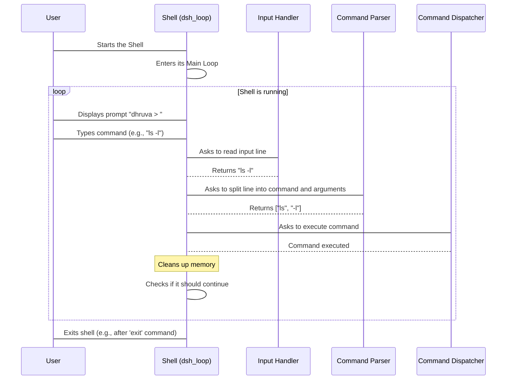

# Chapter 1: Shell Main Loop

Welcome to `dhruva_shell`! Have you ever wondered how your computer's command line (like Bash or PowerShell) seems to always be waiting for your commands, ready to instantly respond? You type something, press Enter, and it does what you ask, then immediately asks for another command. It never just closes after one task! This continuous readiness is thanks to something called the **Shell Main Loop**.

## The Heart of the Shell

Imagine the shell's main loop as the "heart" or "central engine" of `dhruva_shell`. It's a never-ending cycle that keeps the shell alive and always ready for your instructions. Think of it like a very patient and helpful assistant who continuously asks, "What can I do for you next?", waits for your response, processes it, and then asks again.

**The problem it solves:** How does `dhruva_shell` constantly listen for your input and run commands without quitting after each one? If our shell only ran one command and then exited, it would be incredibly annoying! You'd have to start it over every single time you wanted to do something.

**The solution:** A continuous loop! The Shell Main Loop ensures `dhruva_shell` stays active, always ready for your next command until you explicitly tell it to stop.

## Getting Started: How the Loop Begins

When you first start `dhruva_shell`, the very first thing it does is enter this main loop. It's like flipping a switch that puts the assistant into "active listening" mode.

Let's look at the `main` function in `src/main.c`, which is the entry point of our entire shell program:

```c
// File: src/main.c

int main(int argc, char **argv) {
    // ... other initial setup tasks (skipped for now) ...

    // This line starts the main loop of the shell
    dsh_loop();

    // ... cleanup tasks before exiting (skipped for now) ...

    return EXIT_SUCCESS;
}
```

As you can see, the `main` function simply calls `dsh_loop()`. This means `dsh_loop()` is responsible for *everything* that happens while `dhruva_shell` is running and interactive.

## Inside the Main Loop: A Constant Cycle

The `dsh_loop()` function is where all the magic happens. It performs a few critical steps in a repeating cycle:

1.  **Prompt**: It shows you a `dhruva >` message, inviting you to type a command.
2.  **Read**: It waits for you to type something and press Enter.
3.  **Parse**: It takes what you typed and breaks it down into a command and any arguments.
4.  **Execute**: It runs the command you entered.
5.  **Repeat**: After the command is finished, it cleans up and goes back to step 1, displaying the prompt again.

This cycle continues endlessly until you type a command that tells the shell to stop (like `exit`).

Let's visualize this continuous flow:



## The Code: `dsh_loop` Explained

Now, let's look at the actual code for `dsh_loop` in `src/main.c`. It's surprisingly simple!

```c
// File: src/main.c

void dsh_loop(void) {
    char *line;   // Will store the line of text you type
    char **args;  // Will store the command and its arguments
    int status;   // Tells the loop whether to continue or stop

    // This 'do-while' loop keeps the shell running
    do {
        printf("dhruva > ");            // 1. Show the prompt
        line = dsh_read_line();         // 2. Read what you type
        args = dsh_split_line(line);    // 3. Break it into parts
        status = dsh_execute(args);     // 4. Run the command

        free(line);                     // Clean up memory for the line
        free(args);                     // Clean up memory for the arguments

    } while (status); // Continue as long as 'status' is not 0 (meaning 'exit')
}
```

Let's break down each key line inside the `do-while` loop:

*   `printf("dhruva > ");`: This line prints our simple prompt `dhruva > ` to the terminal. This tells you the shell is ready for your input.
*   `line = dsh_read_line();`: This is where the shell waits for you! The `dsh_read_line()` function (which we'll explore in the [Input Handler](02_input_handler_.md) chapter) reads everything you type until you hit Enter, and stores it in the `line` variable.
*   `args = dsh_split_line(line);`: Once the line is read, `dsh_split_line()` (covered in the [Command Parser](03_command_parser_.md) chapter) takes that raw line of text and breaks it into separate words or "tokens". For example, "ls -l" becomes `["ls", "-l", NULL]`.
*   `status = dsh_execute(args);`: This is the crucial step! `dsh_execute()` (from the [Command Dispatcher](04_command_dispatcher_.md) chapter) takes the parsed command and its arguments and figures out how to run it. It returns a `status` value: `1` if the shell should continue running, or `0` if it should exit.
*   `free(line);` and `free(args);`: After executing the command, we free up the memory that was used to store the `line` and `args`. This is important for keeping our shell efficient and preventing memory leaks, a concept we'll touch upon in the [Dynamic Memory Manager](07_dynamic_memory_manager_.md) chapter.
*   `} while (status);`: This is the condition for our `do-while` loop. As long as `status` is `1` (or any non-zero value), the loop will run again from the beginning. If `status` becomes `0` (which happens when you type `exit`), the loop stops, and the `dsh_loop` function finishes, eventually leading to the shell program exiting.

## Summary

The Shell Main Loop (`dsh_loop`) is the foundational piece of `dhruva_shell`. It provides the continuous interactive experience you expect from a command-line interface. It constantly prompts you, reads your input, breaks it down, executes the command, and then prepares for the next one, repeating this cycle until you tell it to stop.

In the next chapter, we'll dive deeper into the first step of this loop: how `dhruva_shell` actually reads your input from the keyboard.

[Next Chapter: Input Handler](02_input_handler_.md)

---
